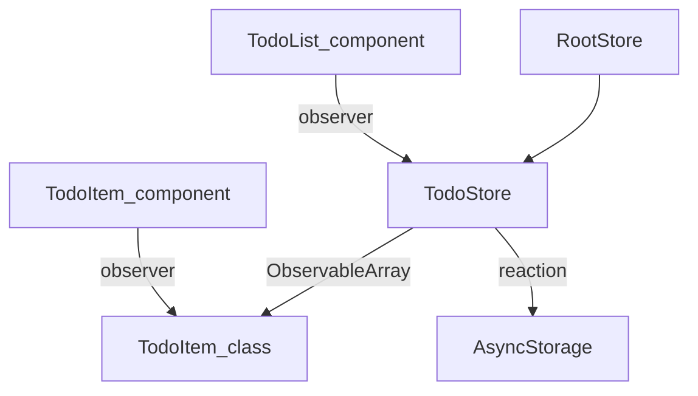

# MobX Full Decorator Migration Plan

## Overview

Convert the project from `makeAutoObservable` to explicit MobX decorators (`@observable`, `@action`, `@computed`), extract a proper `TodoItem` **class** (with its own state and behaviour), and wire up reaction-based auto-persistence.

---

## Architecture After Migration



---

## 1. Toolchain – Decorator Support

MobX 6 decorators require the **legacy** decorator proposal (`@decorator` syntax, stage-2).  
Expo/React Native uses Babel, so we need:

### 1a. `babel.config.js` (or `babel.config.ts`)

Add `@babel/plugin-proposal-decorators` **before** `@babel/plugin-proposal-class-properties`:

```js
plugins: [
  ["@babel/plugin-proposal-decorators", { legacy: true }],
  ["@babel/plugin-proposal-class-properties", { loose: true }],
]
```

Install the plugin if missing:

```
npx expo install @babel/plugin-proposal-decorators
```

### 1b. `tsconfig.json`

```json
{
  "compilerOptions": {
    "experimentalDecorators": true,
    "useDefineForClassFields": false
  }
}
```

> `useDefineForClassFields: false` is **critical** — without it TypeScript's class field initialisation overwrites MobX's property descriptors and decorators silently stop working.

---

## 2. New `TodoItem` Class (`src/stores/TodoItem.ts`)

Extract the `Todo` plain-object type into a **full observable class**. All item-level behaviour lives here.

```ts
import { observable, action, computed, makeObservable } from "mobx";

export class TodoItem {
  @observable id: string;
  @observable title: string;
  @observable done: boolean;

  constructor(id: string, title: string, done = false) {
    this.id = id;
    this.title = title;
    this.done = done;
    makeObservable(this);
  }

  @action toggle() {
    this.done = !this.done;
  }

  @action setTitle(title: string) {
    this.title = title;
  }

  @computed get label() {
    return this.done ? `✓ ${this.title}` : this.title;
  }

  toJSON() {
    return { id: this.id, title: this.title, done: this.done };
  }
}
```

> **Why a class?** Each item is now a self-contained reactive unit. The component only needs to call `item.toggle()` — no store method needed for per-item actions.

---

## 3. Refactored `TodoStore` (`src/stores/todoStore.ts`)

Replace `makeAutoObservable` with explicit decorators. Move item-level mutations to `TodoItem`. Store manages the **collection** and **filter**.

```ts
import { observable, action, computed, reaction, makeObservable } from "mobx";
import AsyncStorage from "@react-native-async-storage/async-storage";
import { RootStore } from "./rootStore";
import { TodoItem } from "./TodoItem";

export type TodoFilter = "all" | "active" | "done";

export class TodoStore {
  @observable todos: TodoItem[] = [];
  @observable filter: TodoFilter = "all";
  @observable hydrated = false;

  private readonly storageKey = "rn-mobx-demo/todos/v1";

  constructor(rootStore: RootStore) {
    makeObservable(this);

    // Auto-persist on any observable change
    reaction(
      () => ({
        todos: this.todos.map(t => t.toJSON()),
        filter: this.filter,
      }),
      () => this.persist(),
      { delay: 300 }   // debounce 300 ms
    );
  }

  // ── Computed ──────────────────────────────────────────────
  @computed get totalCount()      { return this.todos.length; }
  @computed get completedCount()  { return this.todos.filter(t => t.done).length; }
  @computed get activeCount()     { return this.todos.filter(t => !t.done).length; }
  @computed get completionRate()  {
    return this.todos.length === 0
      ? 0
      : Math.round((this.completedCount / this.todos.length) * 100);
  }
  @computed get filteredTodos(): TodoItem[] {
    switch (this.filter) {
      case "active": return this.todos.filter(t => !t.done);
      case "done":   return this.todos.filter(t => t.done);
      default:       return this.todos;
    }
  }

  // ── Actions ───────────────────────────────────────────────
  @action setFilter(filter: TodoFilter) { this.filter = filter; }

  @action addTodo(title: string) {
    if (!title.trim()) return;
    this.todos.push(new TodoItem(Date.now().toString(), title));
  }

  @action removeTodo(id: string) {
    this.todos = this.todos.filter(t => t.id !== id);
  }

  @action clearCompleted() {
    this.todos = this.todos.filter(t => !t.done);
  }

  @action private setHydrated(value: boolean) { this.hydrated = value; }

  @action private setTodos(items: TodoItem[]) { this.todos = items; }

  // ── Persistence ───────────────────────────────────────────
  async hydrate() {
    try {
      const raw = await AsyncStorage.getItem(this.storageKey);
      if (raw) {
        const parsed = JSON.parse(raw) as {
          todos: { id: string; title: string; done: boolean }[];
          filter: TodoFilter;
        };
        this.setTodos((parsed.todos ?? []).map(
          t => new TodoItem(t.id, t.title, t.done)
        ));
        this.setFilter(parsed.filter ?? "all");
      }
    } catch {
      this.setTodos([]);
      this.setFilter("all");
    } finally {
      this.setHydrated(true);
    }
  }

  async persist() {
    try {
      await AsyncStorage.setItem(
        this.storageKey,
        JSON.stringify({
          todos: this.todos.map(t => t.toJSON()),
          filter: this.filter,
        })
      );
    } catch { /* log / Sentry */ }
  }

  async clearStorage() {
    await AsyncStorage.removeItem(this.storageKey);
    this.setTodos([]);
    this.setFilter("all");
  }
}
```

> **Key changes vs current code:**
> - `makeAutoObservable` → `makeObservable` + explicit decorators
> - `toggleTodo(id)` removed from store — call `item.toggle()` directly on the `TodoItem` instance
> - `reaction` added in constructor for auto-persist with 300 ms debounce
> - `hydrate()` reconstructs `TodoItem` class instances (not plain objects)

---

## 4. Updated `TodoItem` Component (`src/components/TodoItem.tsx`)

The prop type changes from the plain `Todo` type to the `TodoItem` class. `onToggle`/`onRemove` callbacks are simplified because toggle is now on the model.

```tsx
import { TodoItem as TodoItemModel } from "../stores/TodoItem";

type Props = {
  todo: TodoItemModel;
  onRemove: () => void;
};

export const TodoItem = observer(({ todo, onRemove }: Props) => (
  <View style={styles.row}>
    <Pressable onPress={() => todo.toggle()} style={styles.titleWrap}>
      <Text style={[styles.title, todo.done && styles.done]}>
        {todo.title}
      </Text>
    </Pressable>
    <Pressable onPress={onRemove}>
      <Text style={styles.delete}>✕</Text>
    </Pressable>
  </View>
));
```

> `onToggle` prop is removed — the component calls `todo.toggle()` directly.

---

## 5. Updated `TodoList` Component (`src/components/TodoList.tsx`)

Only the `renderItem` callback changes — pass `onRemove` only:

```tsx
renderItem={({ item }) => (
  <TodoItem
    todo={item}
    onRemove={() => todoStore.removeTodo(item.id)}
  />
)}
```

Import `TodoFilter` from `todoStore` (unchanged).

---

## 6. `RootStore` & `StoreContext` — No Changes Needed

Both files are already correct and do not need modification.

---

## File Change Summary

| File | Change |
|------|--------|
| `babel.config.js` | Add decorator plugins |
| `tsconfig.json` | `experimentalDecorators: true`, `useDefineForClassFields: false` |
| `src/stores/TodoItem.ts` | **NEW** — `TodoItem` class with `@observable`, `@action`, `@computed` |
| `src/stores/todoStore.ts` | Replace `makeAutoObservable` → `makeObservable` + decorators; add `reaction`; remove `toggleTodo`; update `hydrate` |
| `src/components/TodoItem.tsx` | Accept `TodoItem` class; remove `onToggle` prop; call `todo.toggle()` directly |
| `src/components/TodoList.tsx` | Remove `onToggle` from `renderItem`; import `TodoItem` class type |
| `src/stores/rootStore.ts` | No change |
| `src/stores/StoreContext.ts` | No change |

---

## MobX Best Practices Applied

1. **`makeObservable` over `makeAutoObservable`** — explicit, predictable, decorator-friendly
2. **Decorators on class fields** — co-located intent, no boilerplate object maps
3. **`useDefineForClassFields: false`** — prevents TS from clobbering MobX descriptors
4. **`reaction` with debounce** — auto-persist without manual calls; avoids write storms
5. **`toJSON()` on model** — clean serialisation boundary; store never reaches into item internals
6. **Item-level actions on the model** — `toggle()` lives on `TodoItem`, not the store
7. **`@computed` for derived state** — memoised, only recalculates when dependencies change
8. **Private `@action` setters** — `setHydrated`, `setTodos` keep async boundaries clean (MobX strict mode safe)
